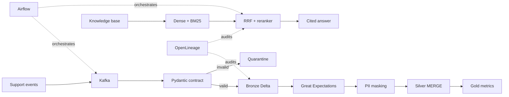

# Real-Time Customer Support Intelligence Platform

[](https://colab.research.google.com/github/N-11-N/real-time-customer-support-intelligence/blob/main/notebooks/customer_support_intelligence_colab.ipynb)

An end-to-end, Colab-ready data platform that ingests customer-support events through Kafka, enforces a Pydantic data contract, persists trusted data in a Bronze/Silver/Gold Delta Lakehouse, runs Great Expectations quality gates, masks PII, emits OpenLineage events, and serves grounded answers through hybrid RAG with cross-encoder reranking.

## Why this project

Support agents need current, trustworthy answers. This platform turns live tickets and governed knowledge-base articles into cited answer suggestions while preventing malformed records and sensitive data from reaching downstream systems.

## Architecture



## Rubric coverage

| Deliverable | Implementation | Points |
|---|---|---:|
| Kafka ingestion | Real KRaft broker, producer, consumer, manual commit, Pydantic v2 schema gate | 20 |
| Delta Lakehouse | Bronze/Silver/Gold, schema enforcement, deduplication, Silver `MERGE` upsert | 25 |
| Advanced RAG | sentence chunking, MiniLM embeddings, BM25, RRF, cross-encoder reranking, citations | 25 |
| Orchestration | Airflow DAG with retries and end-to-end dependencies | 15 |
| Quality & lineage | Real Great Expectations checkpoint, quarantine, real OpenLineage file transport | 15 |

## Quick start in Google Colab

1. Click the **Open in Colab** badge above.
2. Review the executed notebook and its saved outputs.
3. To run from a blank state, open `notebooks/customer_support_intelligence_clean.ipynb` and select **Runtime → Run all**. A CPU runtime is sufficient; GPU only speeds up model inference.

The notebook installs the required dependencies, starts a local Kafka KRaft broker, executes all pipeline stages, and prints a final rubric checklist. It requires no paid API key. The RAG answer is extractive and fully grounded; an optional LLM can later be added behind the same retrieval interface.

## Verified Colab run

The complete pipeline was executed successfully on Google Colab on 16 July 2026. The primary notebook, `notebooks/customer_support_intelligence_colab.ipynb`, includes all captured outputs, so reviewers can verify the results without rerunning the pipeline. `notebooks/customer_support_intelligence_clean.ipynb` is provided for reproducibility.

| Check | Verified result |
|---|---:|
| Kafka events sent / received | 4 / 4 |
| Contract accepted / quarantined | 3 / 1 |
| Great Expectations checkpoint | Passed |
| Bronze / Silver / Gold rows | 3 / 3 / 2 |
| Chroma HNSW vectors | 10 |
| Retrieval Hit Rate@3 | 1.00 |
| OpenLineage states | START, COMPLETE |
| Final demonstrated rubric | 100 / 100 |

## Repository structure

```text
.
├── notebooks/  # executed reviewer notebook + clean reproducible notebook
├── src/        # reusable pipeline modules
├── dags/       # production Airflow DAG
├── data/       # version-controlled demo events and knowledge base
├── tests/      # contract and governance tests
├── docs/       # architecture and evaluation notes
└── requirements.txt
```

## Engineering decisions

- Kafka keys events by `ticket_id` to preserve per-ticket ordering.
- The consumer commits only after contract validation, providing at-least-once processing with deterministic deduplication by `event_id`.
- Invalid events are quarantined with partition, offset, and validation reason.
- Bronze preserves accepted source events; Silver masks PII and performs idempotent Delta `MERGE`; Gold contains serving aggregates.
- ChromaDB persists an HNSW vector index. Dense Chroma retrieval and sparse BM25 execute together; RRF combines ranks without tuned weights, and a cross-encoder provides the final precision gate.
- Results are deduplicated at article level before answer construction, preventing repeated citations from overlapping chunks.
- Every answer returns knowledge-base article IDs as citations.
- Airflow is represented as a deployable DAG; Colab runs the equivalent stages interactively because a persistent scheduler is inappropriate for an ephemeral notebook runtime.

## Tests

```bash
pip install -r requirements.txt
pytest -q
```

## Known production extensions

- Replace the single-node Colab broker with managed Kafka/Redpanda.
- Store Delta tables on S3/ADLS and Chroma/Qdrant on durable infrastructure.
- Send OpenLineage events to Marquez rather than file transport.
- Add authentication, RBAC, SLA alerts, and a human-feedback evaluation set.

## License

MIT — demonstration data is synthetic and contains no real customer information.
